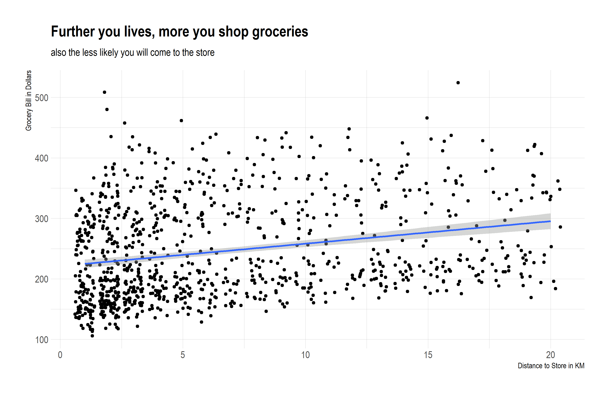

```{r setup, include=FALSE}
knitr::opts_chunk$set(echo = FALSE, warning = F, message = F, fig.width=10, fig.height=6.5)
extrafont::loadfonts(device = "win")
windowsFonts("Arial_Narrow" = windowsFont("Arial Narrow"))
options(mc.cores = parallel::detectCores())
library(tidyverse)
theme_set(hrbrthemes::theme_ipsum(base_family = "Arial_Narrow"))
```

```{r data}
df <- rio::import("MMA_860_Grocery_Data.xlsx")
```

## Store only serves a limited region

```{r scatter}
p <- df %>% 
  ggplot(aes(Distance_to_Store,Grocery_Bill))+
  geom_jitter()+
  geom_smooth(method = lm)+
  labs(title = "Further you lives, more you shop groceries",
       subtitle = "also the less likely you will come to the store",
       x = "Distance to Store in KM",
       y = "Grocery Bill in Dollars"
       )+
    theme(
        rect = element_rect(fill = "transparent") # all rectangles
      )
ggsave(p, filename = "scatter.png",  bg = "transparent")

```

## Dataset have issues

```{r hist}
p <- df %>% 
  ggplot(aes(Family_Income))+
  geom_histogram()+
  labs(
    title = "Gaps in family income suggests data integrity issues",
    y = ""
  )+
  scale_y_continuous(breaks = NULL)

ggsave(p, filename = "hist.png",  bg = "transparent")

```

## Serve shoppers with smaller family size

```{r bar}
p <- df %>% 
  ggplot(aes(y = Family_Size, x = Grocery_Bill))+
  geom_col()+
  scale_y_continuous(breaks = 1:6)+
  labs(
    title = "Most sales were to smaller families"
  )

ggsave(p, filename = "bar.png",  bg = "transparent")


```